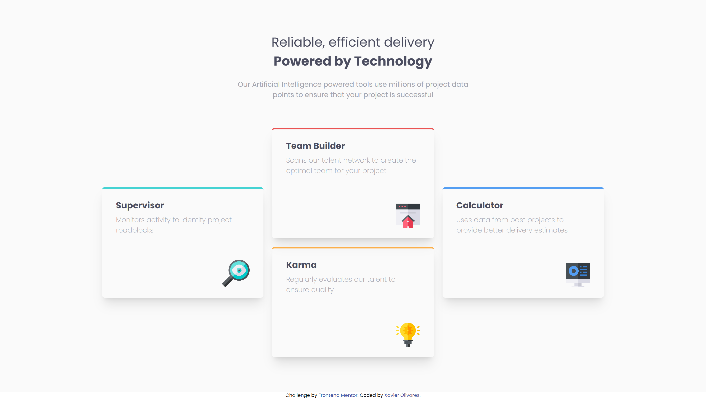
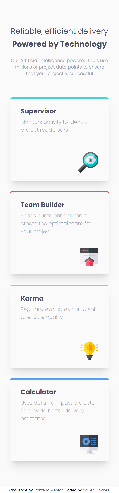

# Frontend Mentor - Four card feature section solution

This is a solution to the [Four card feature section challenge on Frontend Mentor](https://www.frontendmentor.io/challenges/four-card-feature-section-weK1eFYK). Frontend Mentor challenges help you improve your coding skills by building realistic projects. 

## Table of contents

- [Overview](#overview)
  - [The challenge](#the-challenge)
  - [Screenshot](#screenshot)
  - [Links](#links)
- [My process](#my-process)
  - [Built with](#built-with)
  - [What I learned](#what-i-learned)
  - [Continued development](#continued-development)

## Overview

### The challenge

Users should be able to:

- View the optimal layout for the site depending on their device's screen size

### Screenshot

### Links

- Solution URL: [https://github.com/XavOli/four-card-feature-section-master](https://github.com/XavOli/four-card-feature-section-master)
- Live Site URL: [https://xavoli.github.io/four-card-feature-section-master/](https://xavoli.github.io/four-card-feature-section-master/)

## My process

### Built with

- Semantic HTML5 markup
- CSS custom properties
- Flexbox
- CSS Grid
- Mobile-first workflow
- [Tailwind](https://tailwindcss.com/) - Tailwind Framework

### What I learned

This was my first time using Tailwind to create my own solution. I had only done follow-along small projects before.

### Continued development

I did not use any custom parameters in Tailwind and only used the pre-determined values. Adding some custom values would've allowed me to get a solution closed to the screenshots.